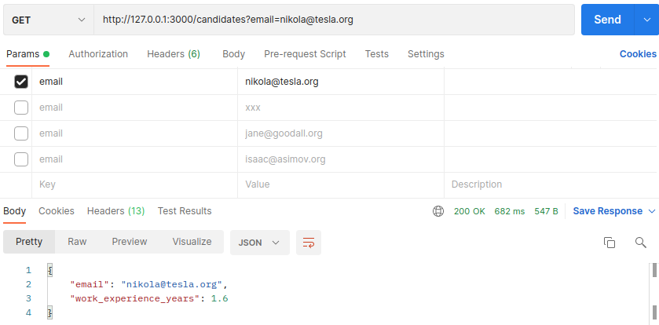
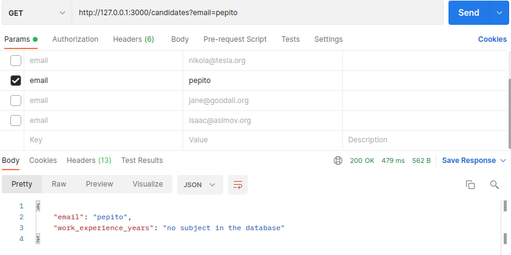
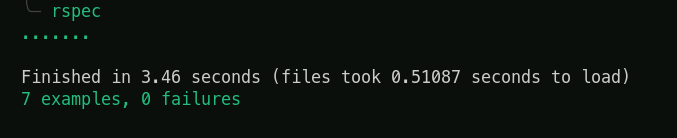

# WorkOnLaw challenge

# Objetivos

- El endpoint recibe como parámetro del request el correo del abogado que se necesita consultar

- El cálculo de la experiencia se realiza en base a las fechas de inicio y término de cada trabajo
  La respuesta esperada es un json que contenga el correo y experiencia del abogado requerido. Abajo un ejemplo
  {
  "email": "example@email.com",
  "work_experience_years": 1.6
  }

- Si un trabajo no tiene fecha de término, se entiende que el abogado aún se encuentra trabajando en ese lugar.
- Los años de experiencia deben venir en formato decimal. Queda a tu elección el método de redondeo a utilizar
- Se debe utilizar Ruby On Rails
- Como entregable se espera que nos compartas una URL de un repo para descargar el código

No obligatorio, pero suma varios puntos extra :

- Uso de pruebas automatizadas

- Si aplicas la siguiente regla en el cálculo de la experiencia: En caso de que el abogado haya trabajado en 2 lugares al mismo tiempo, sólo cuenta la experiencia de uno de estos trabajos. El criterio aplica a nivel de días, por lo tanto se debe considerar que hay días que podrían coincidir entre ambos empleos y otros no.

# Descripcion del Desafio

El objetivo del projecto es hacer un request en una API externa, regresar el correo del sujeto con los años de experiencia, sin duplicar los dias si es que el abogado trabajo en dos lugares en un mismo periodo de tiempo.

Para el desarrollo del proyecto fue usado:

- Rails v 6.1.4.4
- Ruby v 2.7.2

## Endpoint of API

| Method | Endpoint   |                    Functionality |
| ------ | ---------- | -------------------------------: |
| GET    | candidates | Busqueda de candidatos en la API |

- Cuando la persona esta en la base de datos:
  
- Cuando la persona no se encuentra en la base de datos:
  

## How to start the project from your Local environment

- Correr en terminal el comando - `git clone https://github.com/Wusinho/WorkOnLaw.git`
- Cd en el directorio creado
- Run $ `bundle install`
- En la terminal tipear $ `rails db:migrate`
- En la terminal tipear $ `rails server`

## Tests

- En la terminal tipear $ `rspec`

## Duplicidad de datos

- Para evitar la duplicidad de dias, se creo un service en la ruta:

  `./spec/services/candidate_search_services_spec.rb`

## Author

👤 **Heber Lazo**

- Github: [@Wusinho](https://github.com/Wusinho)
- LinkedIn: [Heber Lazo](https://www.linkedin.com/in/heber-lazo-benza-523266133/)

## 🤝 Contributing

Contributions, issues, and feature requests are welcome!

## Show your support

Give a star if you :star: like this project!

## 📝 License

This project is [MIT](LICENSE) licensed.
